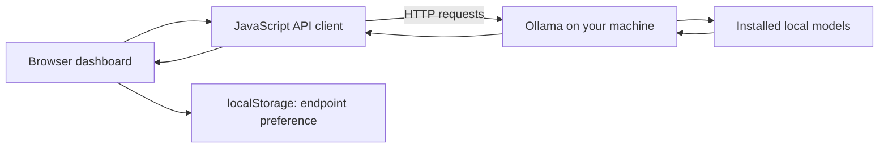

# Local SLM Ollama Lab

<strong>A browser-based control panel for connecting to a local Ollama server, managing models, chatting, and running lightweight comparisons.</strong>

Vanilla JavaScript · Ollama REST API · Local-first

## Project overview

The static dashboard talks directly to an Ollama instance at the configured URL (default `http://localhost:11434`). The client code reads installed/running models, sends chat and generation requests, and supports model pull and delete actions. The selected Ollama URL is saved in browser local storage.

## What it does

- Connects to an Ollama server and lists available/running models
- Starts chat and text-generation requests
- Pulls and deletes models through Ollama's API
- Runs browser-side benchmark flows and reports their returned timing/results
- Remembers the configured endpoint in this browser

## Architecture

## Run locally

1. Install Node.js.
2. Install and start [Ollama](https://ollama.com/) on the same computer.
3. From the repository root, run `npm install` if needed, then `npm run dev` (the script serves the static files on port 3000).
4. Open `http://localhost:3000` and check that the endpoint points to `http://localhost:11434`.
5. If the browser reports a connection or CORS error, configure Ollama's allowed origins for the dashboard's origin and restart Ollama.

The browser app does not install Ollama or download models automatically. Model downloads use the Ollama server you connect to.

## Deployment notes

This repository includes a Vercel static-site configuration. A public static deployment cannot reach a visitor's `localhost` automatically: users need to run Ollama locally and allow the deployed website origin in their Ollama CORS settings. Never expose a remote Ollama server to the public internet without access controls.

## Project structure

- `index.html` — dashboard markup
- `css/style.css` — visual system and responsive layout
- `js/api.js` — Ollama REST client
- `js/models.js`, `js/chat.js`, `js/benchmark.js` — model, chat, and benchmark interactions
- `vercel.json` — static deployment routing
